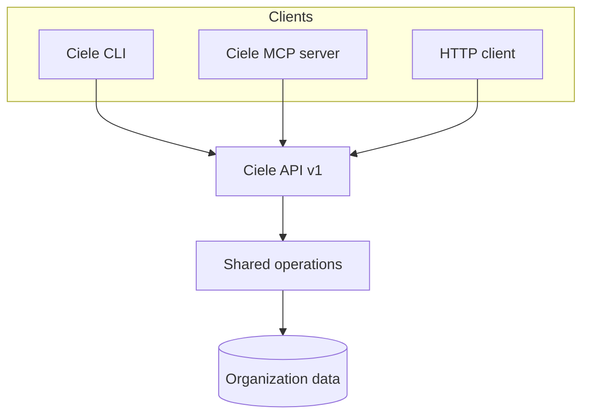

import { Cards, Card } from 'fumadocs-ui/components/card';

Ciele bietet drei Schnittstellen für die programmgesteuerte Administration. Jede
Schnittstelle verwendet dieselben Operationen und Rollenprüfungen wie die
Administratorkonsole.

<Cards>
  <Card title="API" href="/developers/api" description="Call the versioned HTTP API and read its OpenAPI contract." />
  <Card title="CLI" href="/developers/cli" description="Manage an Organization from a terminal or a CI job." />
  <Card title="MCP server" href="/developers/mcp" description="Give supported AI clients controlled access to Ciele operations." />
  <Card title="AI clients" href="/developers/ai-clients" description="Configure supported clients and use copyable prompts." />
</Cards>

## Gemeinsames Verbindungsmodell

Für alle drei Schnittstellen ist ein Organisations-API-Schlüssel erforderlich.
Die zugewiesene Rolle steuert die Operationen, die der Schlüssel verwenden kann.

Der gehostete Dienst verwendet standardmäßig `https://platform.ciele.app`. Eine
selbst gehostete Installation verwendet ihren eigenen öffentlichen Ursprung.

<Callout title="Use the minimum Role">
Create a viewer key for read operations. Create a higher-role key only when the client must change data or publish an Assistant.
</Callout>

## Verfügbare Domains

Die aktuelle API umfasst Assistenten, Flows, Knowledge, Veröffentlichung,
Inbox-Konversationen und Verbesserungen.

Die API stellt nicht alle Konsolenfunktionen zur Verfügung. Beispielsweise
bleiben das Hochladen von Avataren und das Erstellen von Verbesserungen der
Konsole vorbehalten.
