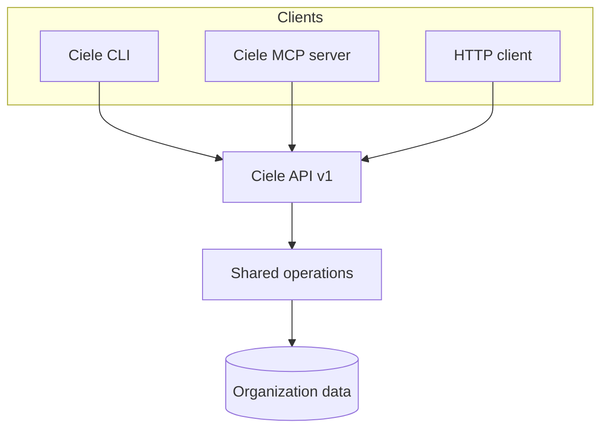

import { Cards, Card } from 'fumadocs-ui/components/card';

Ciele propose trois interfaces pour l'administration programmatique. Chaque
interface utilise les mêmes opérations et les mêmes vérifications de rôle que la
console d'administration.

<Cards>
  <Card title="API" href="/developers/api" description="Call the versioned HTTP API and read its OpenAPI contract." />
  <Card title="CLI" href="/developers/cli" description="Manage an Organization from a terminal or a CI job." />
  <Card title="MCP server" href="/developers/mcp" description="Give supported AI clients controlled access to Ciele operations." />
  <Card title="AI clients" href="/developers/ai-clients" description="Configure supported clients and use copyable prompts." />
</Cards>

## Modèle de connexion commun

Les trois interfaces nécessitent une clé API d'organisation. Le rôle attribué
contrôle les opérations que la clé peut utiliser.

Le service hébergé utilise `https://platform.ciele.app` par défaut. Une
installation auto-hébergée utilise sa propre origine publique.

<Callout title="Use the minimum Role">
Create a viewer key for read operations. Create a higher-role key only when the client must change data or publish an Assistant.
</Callout>

## Domaines disponibles

L'API actuelle inclut les Assistants, les Flux, la Connaissance, la publication,
les conversations de la boîte de réception et les Améliorations.

L'API n'expose pas toutes les fonctions de la console. Par exemple, le
téléchargement d'avatar et la création d'amélioration restent réservés à la
console.
