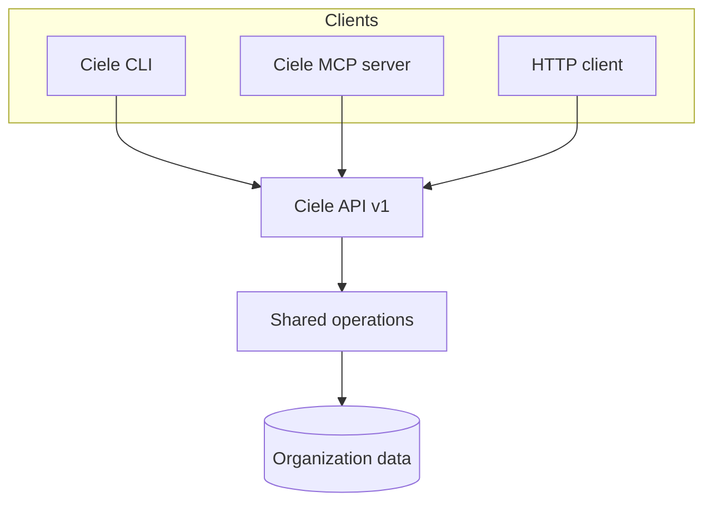

import { Cards, Card } from 'fumadocs-ui/components/card';

Ciele offre tre interfacce per l'amministrazione programmatica. Ogni interfaccia
utilizza le stesse operazioni e gli stessi controlli dei ruoli della console di
amministrazione.

<Cards>
  <Card title="API" href="/developers/api" description="Call the versioned HTTP API and read its OpenAPI contract." />
  <Card title="CLI" href="/developers/cli" description="Manage an Organization from a terminal or a CI job." />
  <Card title="MCP server" href="/developers/mcp" description="Give supported AI clients controlled access to Ciele operations." />
  <Card title="AI clients" href="/developers/ai-clients" description="Configure supported clients and use copyable prompts." />
</Cards>

## Modello di connessione comune

Tutte e tre le interfacce richiedono una chiave API dell'organizzazione. Il
ruolo assegnato controlla le operazioni che la chiave può eseguire.

Il servizio in hosting utilizza `https://platform.ciele.app` per impostazione
predefinita. Un'installazione self-hosted utilizza la propria origine pubblica.

<Callout title="Use the minimum Role">
Create a viewer key for read operations. Create a higher-role key only when the client must change data or publish an Assistant.
</Callout>

## Domini disponibili

L'API attuale include Assistenti, Flussi, Knowledge, pubblicazione,
conversazioni in Posta in arrivo e Miglioramenti.

L'API non espone tutte le funzioni della console. Ad esempio, il caricamento
dell'avatar e la creazione di Miglioramenti rimangono disponibili solo dalla
console.
