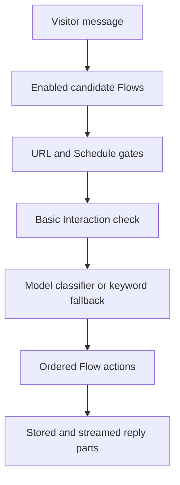

## Nachrichtenpfad

`messageFlowCandidates` liefert Kandidaten an beide Routing-Engines. Diese
Grenze verhindert, dass objektive Bedingungen zu unterschiedlichen
Router-Ergebnissen führen.

Der Konversationskontext liefert semantische Beispiele für die Klassifizierung.
Es fungiert nicht als unabhängiges Boolesches Gate.

## Höflichkeits-Shortcut

Der integrierte Basic Interaction Flow kann eine kurze, reine
Höflichkeitsnachricht vor der Intent Classification verarbeiten. Ein früherer
berechtigter benutzerdefinierter Flow hat weiterhin Priorität.

Die Verknüpfung wird nicht aktiviert, wenn der Assistent eine Frage stellt oder
wenn eine Nachricht eine Informationsanfrage enthält.

## Proaktiver Pfad

Die Einbettung meldet Seitenlade-, Verweilzeit- und Chat-Öffnungsereignisse. Der
Server validiert den konfigurierten Trigger und den Zustellstatus.

Ein proaktiver Flow enthält eine Notification-Aktion und keine Bedingungen. Die
Aktion gibt konfigurierten Inhalt ohne Modellaufruf aus.

## Ausführung von Aktionen

Aktionen werden in der gespeicherten Reihenfolge ausgeführt. Jede Aktion gibt
strukturierte Antwortteile oder einen stillen Effekt zurück.

Generative Arbeit bleibt innerhalb von Basic Reply, Search Knowledge,
generierten Follow-ups und unterstützten Empfehlungspfaden.

## Übergabe

Handover lädt einen veröffentlichten Ziel-Assistenten in derselben Organisation.
Sie führt die Besuchernachricht einmal durch diesen Zielassistenten.

Die Zielausführung ignoriert eine weitere Übergabe. Diese Regel verhindert eine
unbegrenzte Assistant-Kette.
