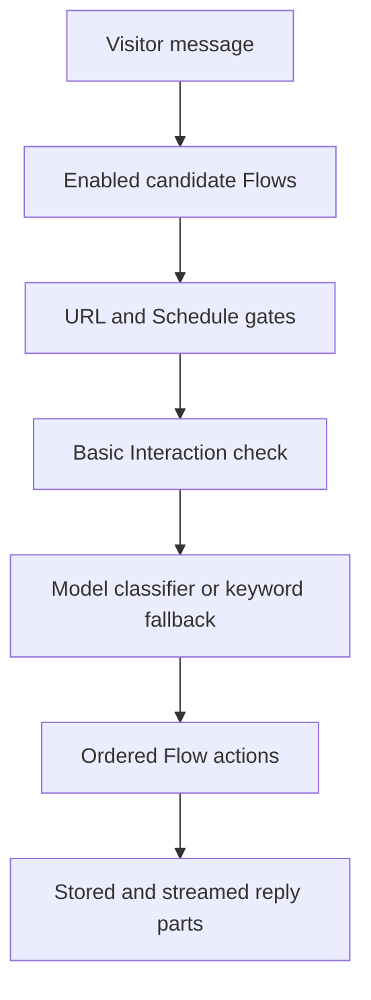

## Ruta del mensaje

`messageFlowCandidates` proporciona candidatos a ambos motores de enrutamiento.
Este límite evita que las condiciones objetivas produzcan resultados de
enrutamiento diferentes.

El contexto de la conversación proporciona ejemplos semánticos para la
clasificación. No actúa como una puerta booleana independiente.

## Atajo de cortesía

El flujo de interacción básico integrado puede gestionar un breve mensaje de
cortesía antes de la clasificación de intenciones. Un flujo personalizado
anterior que cumpla los requisitos sigue teniendo prioridad.

El atajo no se activa después de una pregunta del Asistente ni para un mensaje
que contenga una solicitud de información.

## Ruta proactiva

La incrustación informa sobre la carga de la página, el tiempo de permanencia y
los eventos de apertura del chat. El servidor valida el desencadenante
configurado y el estado de entrega.

Un flujo proactivo contiene una acción de notificación y ninguna condición. La
acción emite el contenido configurado sin una llamada al modelo.

## Ejecución de la acción

Las acciones se ejecutan en el orden almacenado. Cada acción devuelve partes de
respuesta estructuradas o un efecto silencioso.

El trabajo generativo se mantiene dentro de la respuesta básica, la búsqueda de
conocimiento, los seguimientos generados y las rutas de recomendación
compatibles.

## Traspaso

Handover carga un Asistente de destino publicado en la misma Organización.
Ejecuta el mensaje del visitante a través de ese destino una vez.

La ejecución de destino ignora otro traspaso. Esta regla evita una cadena de
Asistentes ilimitada.
