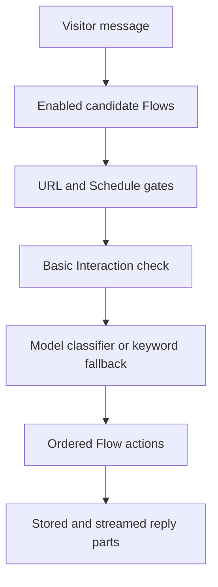

## Chemin du message

`messageFlowCandidates` fournit des candidats aux deux moteurs de routage. Cette
limite empêche les conditions objectives de produire des résultats de routage
différents.

Le contexte de la conversation fournit des exemples sémantiques à la
classification. Il ne fonctionne pas comme une porte booléenne indépendante.

## Raccourci de courtoisie

Le flux d'interaction de base intégré peut gérer un court message de courtoisie
avant la classification des intentions. Un flux personnalisé éligible antérieur
reste prioritaire.

Le raccourci ne s'active pas après une question de l'Assistant ou pour un
message contenant une demande d'information.

## Chemin proactif

L'intégration signale les événements de chargement de page, de temps de présence
et d'ouverture de chat. Le serveur valide le déclencheur configuré et l'état de
livraison.

Un flux proactif contient une action de notification et aucune condition.
L'action émet le contenu configuré sans appel de modèle.

## Exécution de l'action

Les actions sont exécutées dans l'ordre enregistré. Chaque action renvoie des
éléments de réponse structurés ou un effet silencieux.

Le travail génératif reste à l'intérieur de la Réponse de base, de la Recherche
de connaissances, des Suivis générés et des chemins de recommandation pris en
charge.

## Transfert

Handover charge un Assistant cible publié dans la même Organisation. Il exécute
le message du visiteur via cette cible une seule fois.

L'exécution de la cible ignore un autre transfert. Cette règle empêche la
création d'une chaîne illimitée d'assistants.
