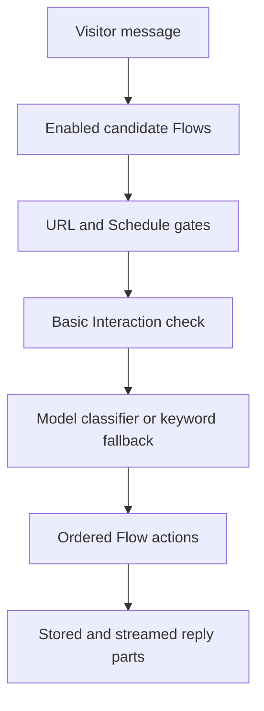

## Percorso del messaggio

`messageFlowCandidates` fornisce candidati a entrambi i motori di routing.
Questo limite impedisce che le condizioni oggettive producano risultati di
routing diversi.

Il contesto della conversazione fornisce esempi semantici per la
classificazione. Non funge da gate booleano indipendente.

## Scorciatoia di cortesia

Il flusso di interazione di base integrato può gestire un breve messaggio di
cortesia prima della classificazione dell'intento. Un Flow personalizzato idoneo
precedente ha comunque la priorità.

La scorciatoia non si attiva dopo una domanda dell'Assistente o per un messaggio
che contiene una richiesta di informazioni.

## Percorso proattivo

L'embed riporta il caricamento della pagina, il tempo di permanenza e gli eventi
di apertura della chat. Il server convalida il trigger configurato e lo stato di
consegna.

Un Flow proattivo contiene un'azione di notifica e nessuna condizione. L'azione
emette il contenuto configurato senza una chiamata al modello.

## Esecuzione dell'azione

Le azioni vengono eseguite nell'ordine memorizzato. Ogni azione restituisce
parti di risposta strutturate o un effetto silenzioso.

Il lavoro generativo rimane all'interno di Basic reply, Search knowledge,
Follow-up generati e percorsi di raccomandazione supportati.

## Passaggio di consegne

Handover carica un Assistente di destinazione pubblicato nella stessa
Organizzazione. Esegue il messaggio del Visitatore attraverso quell'Assistente
di destinazione una sola volta.

L'esecuzione di destinazione ignora un altro passaggio di consegne. Questa
regola impedisce una catena di Assistenti illimitata.
