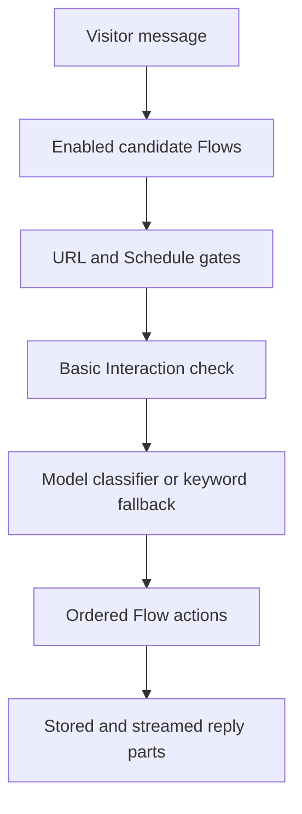

## Message path

`messageFlowCandidates` supplies candidates to both routing engines. This boundary prevents objective conditions from producing different router results.

Conversation context supplies semantic examples to classification. It does not act as an independent boolean gate.

## Courtesy shortcut

The built-in Basic Interaction Flow can handle a short courtesy-only message before Intent Classification. An earlier eligible custom Flow still has priority.

The shortcut does not activate after an Assistant question or for a message that contains an information request.

## Proactive path

The embed reports page load, dwell time, and chat-open events. The server validates the configured trigger and delivery state.

A proactive Flow contains one Notification action and no conditions. The action emits configured content without a model call.

## Action execution

Actions run in stored order. Each action returns structured reply parts or a silent effect.

Generative work stays inside Basic reply, Search knowledge, generated Follow-ups, and supported recommendation paths.

## Handover

Handover loads a published target Assistant in the same Organization. It runs the Visitor message through that target one time.

The target execution ignores another handover. This rule prevents an unbounded Assistant chain.
