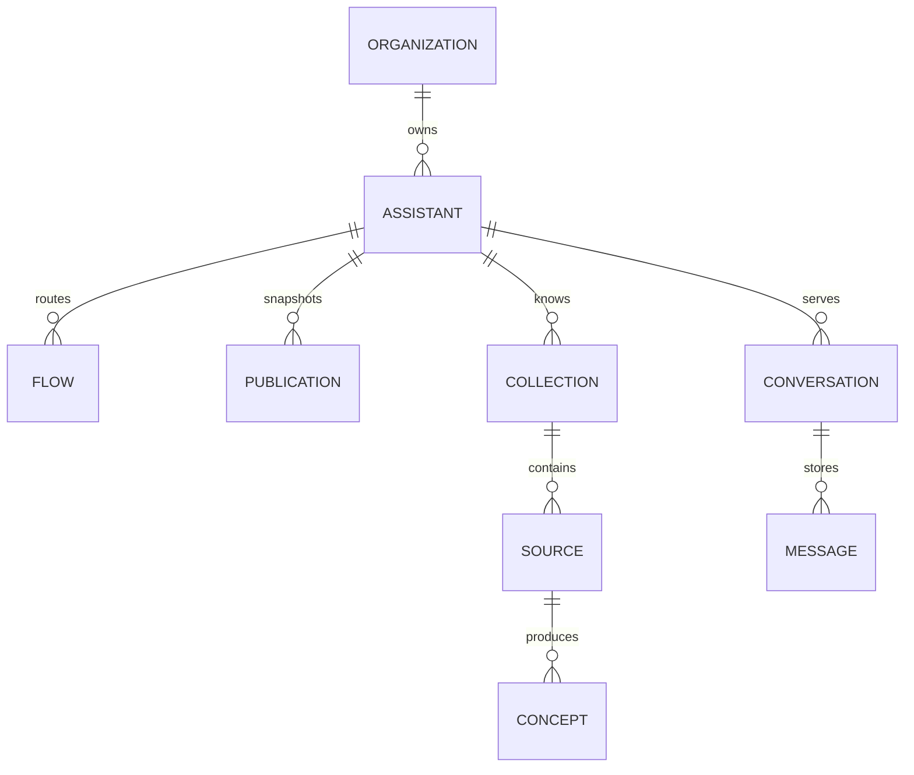

## Tenant-Besitz

Eine Organisation ist der primäre Mandant. Mitglieder treten einer Organisation
mit einer Rolle bei.

Zu den Datensätzen im Besitz der Organisation gehören Assistenten, Helpdesks,
Provider-Verbindungen, API-Schlüssel, Skills, Verbesserungen, Ziele, Warnungen
und Nutzungsdatensätze.

## Konfiguration des Assistenten

Eine Veröffentlichung speichert einen unveränderlichen Snapshot der
Assistenten-Konfiguration. Entwurfsdatensätze bleiben nach der Veröffentlichung
bearbeitbar.

Ein Flow speichert einen Trigger, eine Bedingungskonfiguration und geordnete
Aktionen. Die Laufzeitvalidierung erzwingt gültige Trigger-Aktions-Paare.

## Gesprächsdaten

Eine Konversation gehört zum bedienenden Assistenten und verfolgt eine
Besuchersitzung. In Messages werden typisierte Teile für Text, Zitate,
Schaltflächen, Traces und andere Antworten gespeichert.

Der Sitzungsstatus zeichnet auch die Zustellung proaktiver Benachrichtigungen
auf. Eine Benachrichtigung erzeugt keine Besuchernachricht.

## Programmatische Anmeldeinformationen

Ein API-Schlüssel-Datensatz gehört zu einer Organisation und speichert einen
geheimen Hash, eine Rolle, den Ersteller und den Widerrufsstatus. Das
Klartext-Geheimnis wird nicht gespeichert.

## Isolierung

Der authentifizierte Konsolenzugriff verwendet gegebenenfalls Sicherheit auf
Zeilenebene. Pfade für Service-Rollen müssen eine explizite Organisationsgrenze
hinzufügen.

API v1 verwendet die Organisation, die aus dem API-Schlüssel aufgelöst wurde.
Eine vom Aufrufer ausgewählte Organisation wird nicht als Autorität akzeptiert.
