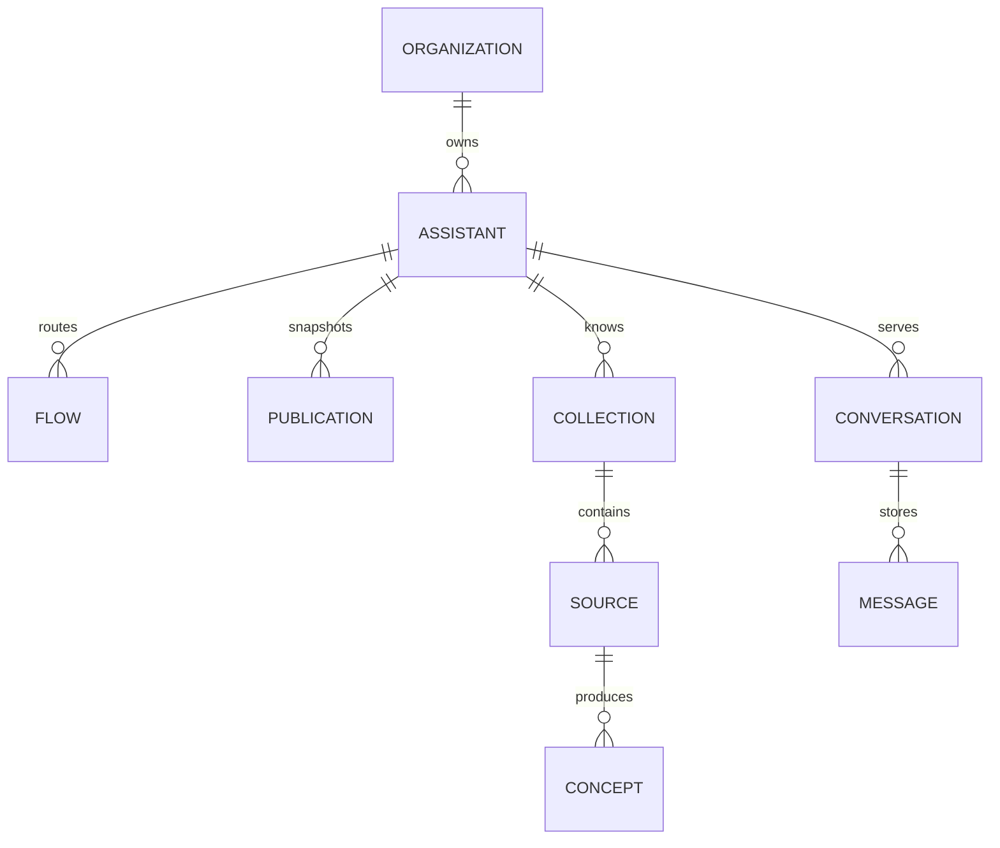

## Propiedad del inquilino

Una Organización es el inquilino principal. Los miembros se unen a una
organización con un rol.

Los registros propiedad de la organización incluyen Asistentes, Servicios de
asistencia, conexiones con proveedores, claves de API, Habilidades, Mejoras,
Objetivos, Alertas y registros de uso.

## Configuración del asistente

Una Publicación almacena una instantánea inmutable de la configuración del
Asistente. Los registros en borrador siguen siendo editables después de su
publicación.

Un Flow almacena un desencadenante, la configuración de la condición y las
acciones ordenadas. La validación en tiempo de ejecución garantiza que los pares
de desencadenante y acción sean válidos.

## Datos de la conversación

Una Conversación pertenece al Asistente que la atiende y realiza un seguimiento
de una sesión de Visitante. Los mensajes almacenan partes tipificadas para
texto, citas, botones, seguimientos y otras respuestas.

El estado de la sesión también registra la entrega de notificaciones proactivas.
Una notificación no crea un mensaje de visitante.

## Credenciales programáticas

Un registro de clave API pertenece a una Organización y almacena un hash
secreto, un Rol, un creador y un estado de revocación. El secreto en texto plano
no se almacena.

## Aislamiento

El acceso autenticado a la consola utiliza seguridad a nivel de fila cuando
corresponde. Las rutas de los roles de servicio deben añadir un límite explícito
de organización.

La API v1 utiliza la organización resuelta a partir de la clave de API. No
acepta como autoridad una organización seleccionada por el llamador.
