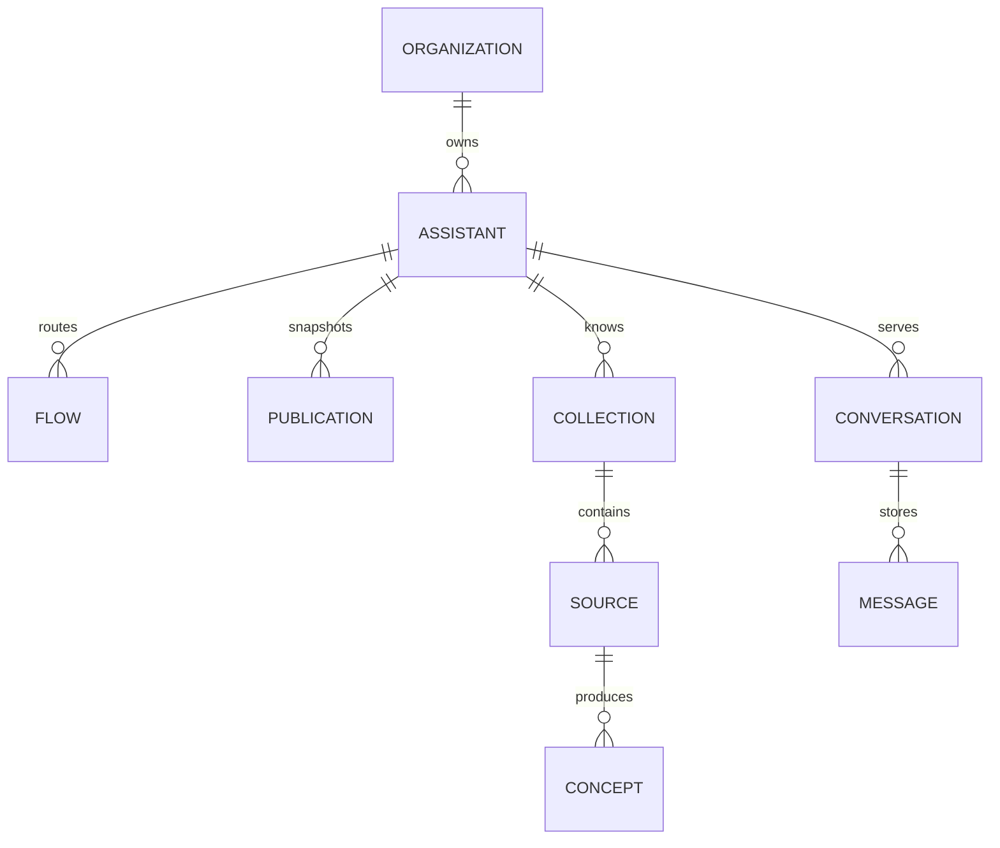

## Propriété du locataire

Une organisation est le locataire principal. Les membres rejoignent une
organisation avec un seul rôle.

Les enregistrements appartenant à l'organisation comprennent les assistants, les
centres d'assistance, les connexions aux fournisseurs, les clés API, les
compétences, les améliorations, les objectifs, les alertes et les
enregistrements d'utilisation.

## Configuration de l'assistant

Une Publication stocke un instantané immuable de la configuration de
l'Assistant. Les enregistrements en brouillon restent modifiables après leur
publication.

Un flux stocke un déclencheur, une configuration de condition et des actions
ordonnées. La validation à l'exécution impose des paires valides de déclencheurs
et d'actions.

## Données de conversation

Une Conversation appartient à l'Assistant en service et suit une session
Visiteur. Les messages stockent des éléments typés pour le texte, les citations,
les boutons, les traces et d'autres réponses.

L'état de la session enregistre également la livraison de notifications
proactives. Une notification ne crée pas de message visiteur.

## Identifiants programmatiques

Un enregistrement de clé API appartient à une organisation et stocke un hachage
secret, un rôle, un créateur et un état de révocation. Le secret en texte clair
n'est pas stocké.

## Isolement

L'accès authentifié à la console utilise la sécurité au niveau des lignes, le
cas échéant. Les chemins d'accès des rôles de service doivent ajouter une limite
explicite d'organisation.

L'API v1 utilise l'organisation résolue à partir de la clé API. Elle n'accepte
pas une organisation sélectionnée par l'appelant comme autorité.
