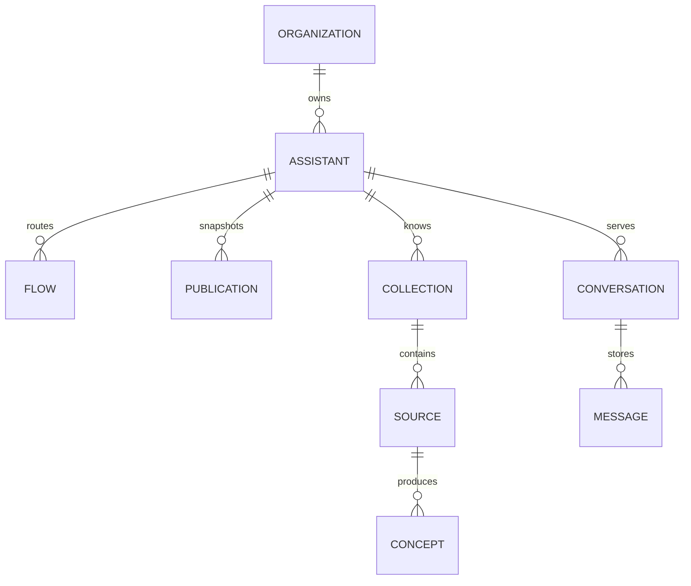

## Proprietà del tenant

Un'Organizzazione è il tenant principale. I membri si uniscono a
un'Organizzazione con un solo Ruolo.

I record di proprietà dell'organizzazione includono Assistenti, Help Desk,
connessioni ai provider, chiavi API, Competenze, Miglioramenti, Obiettivi,
Avvisi e record di utilizzo.

## Configurazione dell'assistente

Una Pubblicazione memorizza un'istantanea immutabile della configurazione
dell'Assistente. Le bozze rimangono modificabili dopo la pubblicazione.

Un Flow memorizza un trigger, la configurazione delle condizioni e le azioni
ordinate. La convalida in fase di esecuzione impone coppie valide di trigger e
azioni.

## Dati di conversazione

Una Conversazione appartiene all'Assistente che la gestisce e tiene traccia di
una sessione del Visitatore. I messaggi memorizzano parti digitate per testo,
citazioni, pulsanti, tracce e altre risposte.

Lo stato della sessione registra anche l'invio di notifiche proattive. Una
Notifica non crea un messaggio Visitatore.

## Credenziali programmatiche

Un record di chiave API appartiene a un'Organizzazione e memorizza un hash
segreto, un Ruolo, il creatore e lo stato di revoca. Il segreto in chiaro non
viene memorizzato.

## Isolamento

L'accesso autenticato alla console utilizza la sicurezza a livello di riga, ove
applicabile. I percorsi dei ruoli di servizio devono aggiungere un limite
esplicito per l'organizzazione.

L'API v1 utilizza l'Organizzazione determinata dalla chiave API. Non accetta
come autorità un'Organizzazione selezionata dal chiamante.
