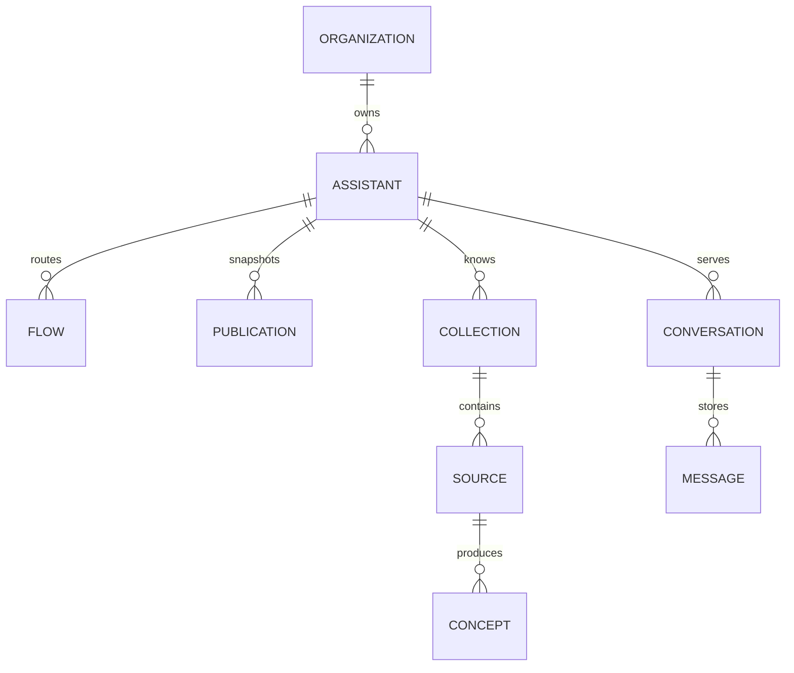

## Tenant ownership

An Organization is the primary tenant. Members join an Organization with one Role.

Organization-owned records include Assistants, Help Desks, provider connections, API keys, Skills, Improvements, Goals, Alerts, and usage records.

## Assistant configuration

A Publication stores an immutable Assistant configuration snapshot. Draft records remain editable after publication.

A Flow stores one trigger, condition configuration, and ordered actions. Runtime validation enforces valid trigger and action pairs.

## Conversation data

A Conversation belongs to the serving Assistant and tracks one Visitor session. Messages store typed parts for text, citations, buttons, traces, and other replies.

Session state also records proactive Notification delivery. A Notification does not create a Visitor message.

## Programmatic credentials

An API-key record belongs to an Organization and stores a secret hash, Role, creator, and revocation state. The plaintext secret is not stored.

## Isolation

Authenticated console access uses row-level security where applicable. Service-role paths must add an explicit Organization boundary.

API v1 uses the Organization resolved from the API key. It does not accept a caller-selected Organization as authority.
