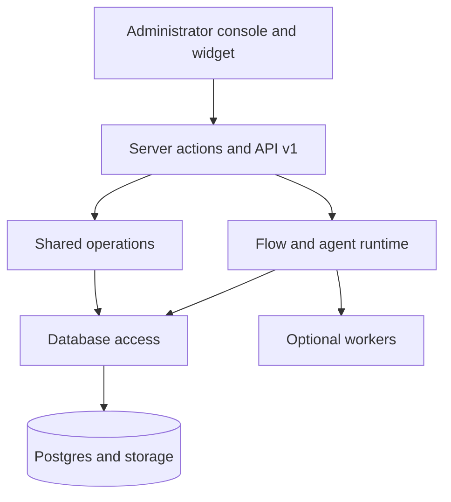

Ciele ist ein TypeScript-Monorepo mit einer Next.js-Produktanwendung, gemeinsam
genutzten Paketen, Postgres und optionalen Workern.

## Hauptgrenzen

Der Flow-Router bleibt maßgeblich. Ein Modell kann die Absicht klassifizieren,
ausgewählte Aktionen generieren und registrierte Tools aufrufen.

Das Modell kann weder die Flow-Reihenfolge, die objektiven Bedingungen, die
Aktionskonfiguration, die Organisationsautorisierung noch die
Netzwerkausgangsprüfungen ersetzen.

## Lesen Sie die Architektur

- Die [Repository-Karte](/self-hosting/architecture/repository-map) zeigt die
  Code-Verantwortlichkeit an.
- [Request flows](/self-hosting/architecture/request-flows) verfolgt Konsolen-,
  API- und Widget-Anfragen.
- [Chat-Runtime](/self-hosting/architecture/chat-runtime) erklärt Trigger,
  Routing und Aktionen.
- Das [Agentic Model](/self-hosting/architecture/agentic-model) erläutert die
  Ausführung von Modellen und Tools.
- Die [Wissens-Pipeline](/self-hosting/architecture/knowledge-pipeline)
  erläutert die Aufnahme und den Abruf.
- [Datenmodell](/self-hosting/architecture/data-model) erklärt die Beziehungen
  zwischen Mandanten und Konversationen.
