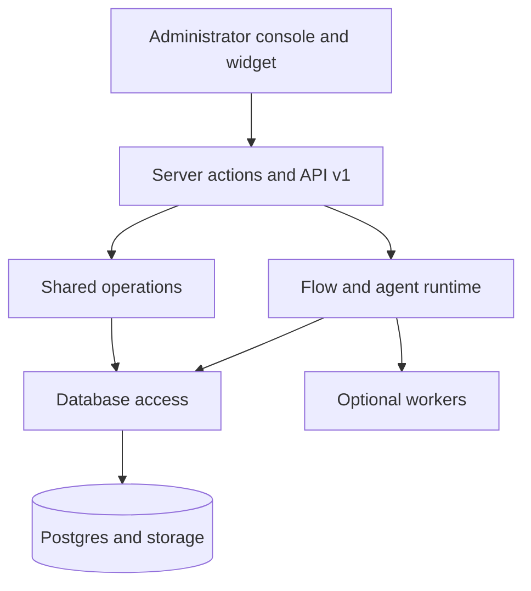

Ciele es un monorepositorio de TypeScript con una aplicación de producto
Next.js, paquetes compartidos, Postgres y trabajadores opcionales.

## Límites principales

El enrutador Flow sigue siendo autoritativo. Un modelo puede clasificar la
intención, generar acciones seleccionadas y llamar a herramientas registradas.

El modelo no puede reemplazar el orden de Flow, las condiciones objetivas, la
configuración de acciones, la autorización de la organización ni las
comprobaciones de salida de red.

## Lee la arquitectura

- [El mapa del repositorio](/self-hosting/architecture/repository-map) localiza
  la propiedad del código.
- [Request flows](/self-hosting/architecture/request-flows) rastrea las
  solicitudes de la consola, la API y los widgets.
- [Chat runtime](/self-hosting/architecture/chat-runtime) explica los
  activadores, el enrutamiento y las acciones.
- [Modelo agentico](/self-hosting/architecture/agentic-model) explica la
  ejecución del modelo y de la herramienta.
- [Knowledge pipeline](/self-hosting/architecture/knowledge-pipeline) explica la
  ingesta y la recuperación.
- [Modelo de datos](/self-hosting/architecture/data-model) explica las
  relaciones entre el inquilino y la conversación.
