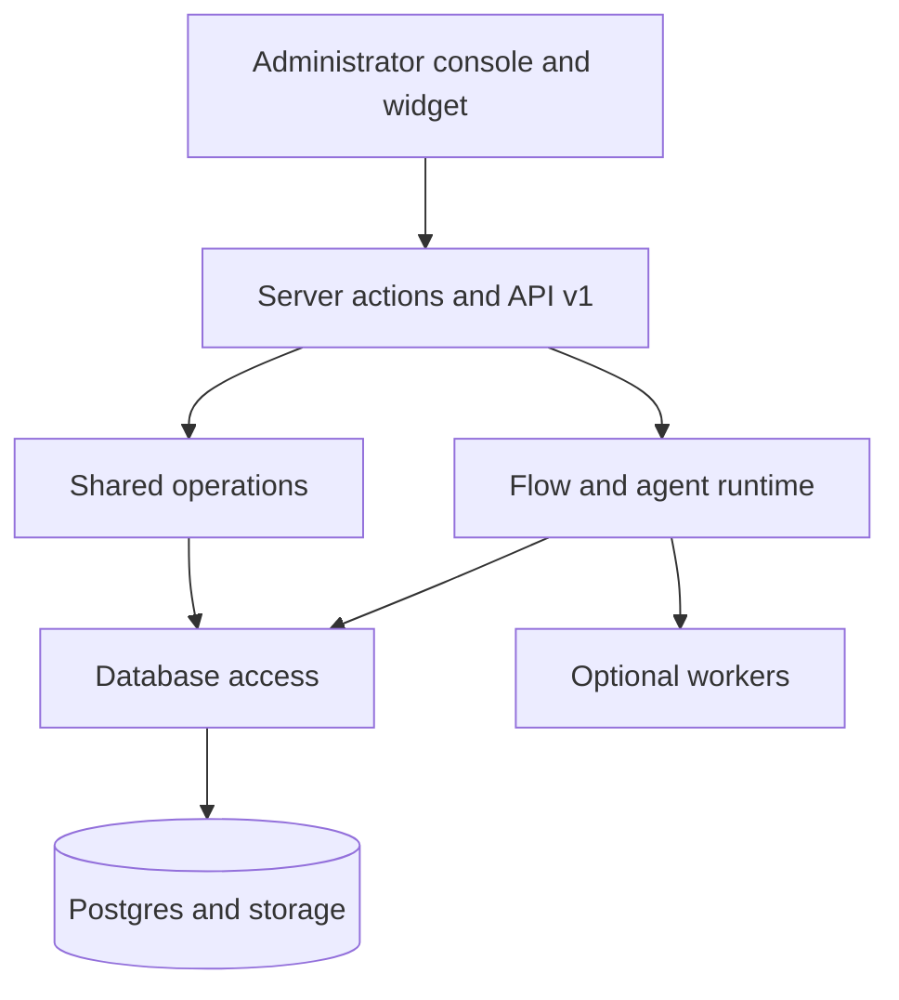

Ciele est un monorepo TypeScript avec une application produit Next.js, des
paquets partagés, Postgres et des workers optionnels.

## Limites principales

Le routeur Flow reste l'autorité. Un modèle peut classer l'intention, générer
des actions sélectionnées et appeler des outils enregistrés.

Le modèle ne peut pas remplacer l'ordre Flow, les conditions objectives, la
configuration des actions, l'autorisation de l'organisation ou les contrôles de
sortie du réseau.

## Lire l'architecture

- La [carte du dépôt](/self-hosting/architecture/repository-map) permet de
  localiser la propriété du code.
- [Request flows](/self-hosting/architecture/request-flows) suit les requêtes de
  la console, de l'API et des widgets.
- [Chat runtime](/self-hosting/architecture/chat-runtime) explique les
  déclencheurs, le routage et les actions.
- [Agentic model](/self-hosting/architecture/agentic-model) explique l'exécution
  du modèle et de l'outil.
- [Knowledge pipeline](/self-hosting/architecture/knowledge-pipeline) explique
  l'ingestion et la récupération.
- [Data model](/self-hosting/architecture/data-model) explique les relations
  entre le locataire et la conversation.
