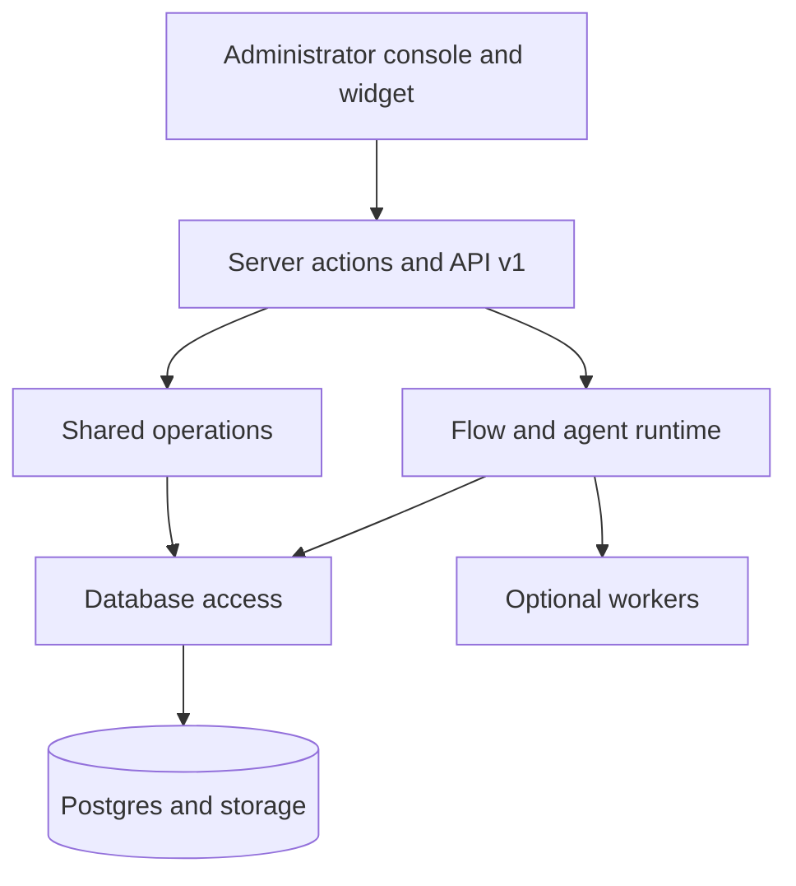

Ciele è un monorepo TypeScript con un'applicazione prodotto Next.js, pacchetti
condivisi, Postgres e worker opzionali.

## Limiti principali

Il router Flow rimane autorevole. Un modello può classificare l'intento,
generare azioni selezionate e chiamare strumenti registrati.

Il modello non può sostituire l'ordine di Flow, le condizioni oggettive, la
configurazione delle azioni, l'autorizzazione dell'organizzazione o i controlli
di uscita dalla rete.

## Leggi l'architettura

- La [mappa del repository](/self-hosting/architecture/repository-map) individua
  la proprietà del codice.
- [Request flows](/self-hosting/architecture/request-flows) tiene traccia delle
  richieste provenienti da console, API e widget.
- [Chat runtime](/self-hosting/architecture/chat-runtime) spiega i trigger, il
  routing e le azioni.
- [Agentic model](/self-hosting/architecture/agentic-model) spiega l'esecuzione
  del modello e dello strumento.
- [Knowledge pipeline](/self-hosting/architecture/knowledge-pipeline) spiega
  l'acquisizione e il recupero.
- [Data model](/self-hosting/architecture/data-model) spiega le relazioni tra
  tenant e Conversation.
