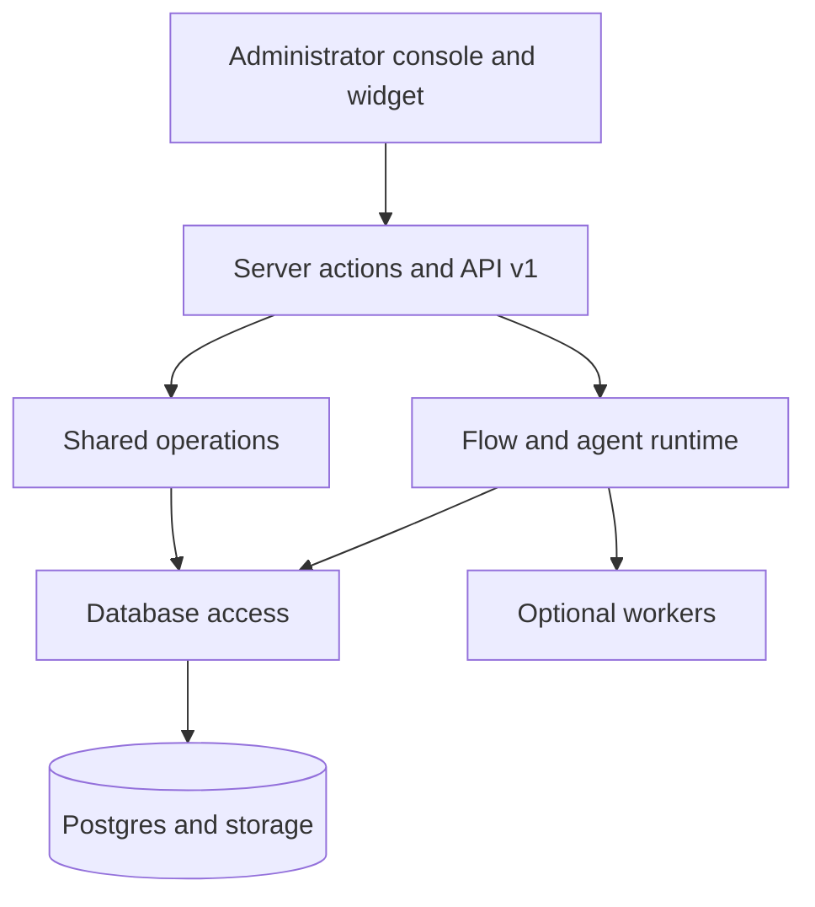

Ciele is a TypeScript monorepo with one Next.js product application, shared packages, Postgres, and optional workers.

## Main boundaries

The Flow router remains authoritative. A model can classify intent, generate selected actions, and call registered tools.

The model cannot replace Flow order, objective conditions, action configuration, Organization authorization, or network egress checks.

## Read the architecture

- [Repository map](/self-hosting/architecture/repository-map) locates code ownership.
- [Request flows](/self-hosting/architecture/request-flows) traces console, API, and widget requests.
- [Chat runtime](/self-hosting/architecture/chat-runtime) explains triggers, routing, and actions.
- [Agentic model](/self-hosting/architecture/agentic-model) explains model and tool execution.
- [Knowledge pipeline](/self-hosting/architecture/knowledge-pipeline) explains ingestion and retrieval.
- [Data model](/self-hosting/architecture/data-model) explains tenant and Conversation relationships.
