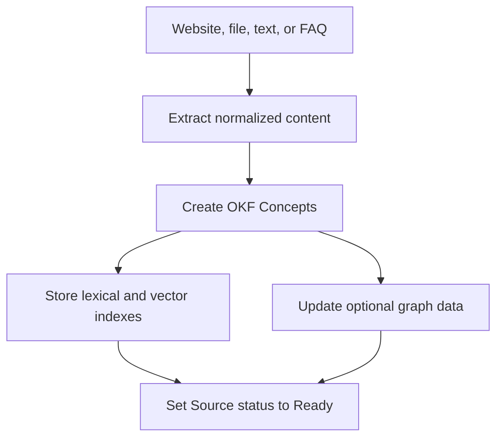

## Aufnahme

Knowledge verwendet Concepts im Open Knowledge Format (OKF). Ein Concept enthält
einen Verweis auf seine ursprüngliche Source.

Durch die Aufnahme von FAQs wird ein kuratiertes Konzept mit Herkunft von Frage
und Antwort erstellt. Bei der Aufnahme von Dateien und Websites bleibt das
ursprüngliche Source-Objekt gegebenenfalls erhalten.

## Abruf

Die Laufzeitumgebung kann Concepts über Vektorsuche und lexikalisches Fallback
abrufen. Im Graph-Modus kann die Navigation über indizierte Concept-Beziehungen
erweitert werden.

Ein Kontexthinweis kann den Abruf auf eine relevante Sammlung oder einen
kursähnlichen Kontext beschränken, wenn die Laufzeit einen solchen bereitstellt.

Deep Search verbessert die Wissensnavigation innerhalb der Grenzen der
Laufzeitumgebung. Es werden keine Abfragen im öffentlichen Web durchgeführt.

## Zitatauflösung

Die endgültige Antwort zitiert benannte Quellen, keine undurchsichtigen
Suchabschnitte. Zitierkennungen verweisen über das Konzept auf die ursprüngliche
Quelle.

Der Besucher kann nach der Antwort die Quellen-Ansicht öffnen. Der Posteingang
speichert dieselben Zitierteile zusammen mit der Konversation.

## Löschen und erneutes Crawlen

Durch das Löschen einer Quelle werden zugehörige Konzepte aus dem aktiven
Graphen und den Suchdaten entfernt. Das erneute Durchforsten der Website startet
die Extraktion und Indizierung für diese Quelle neu.
