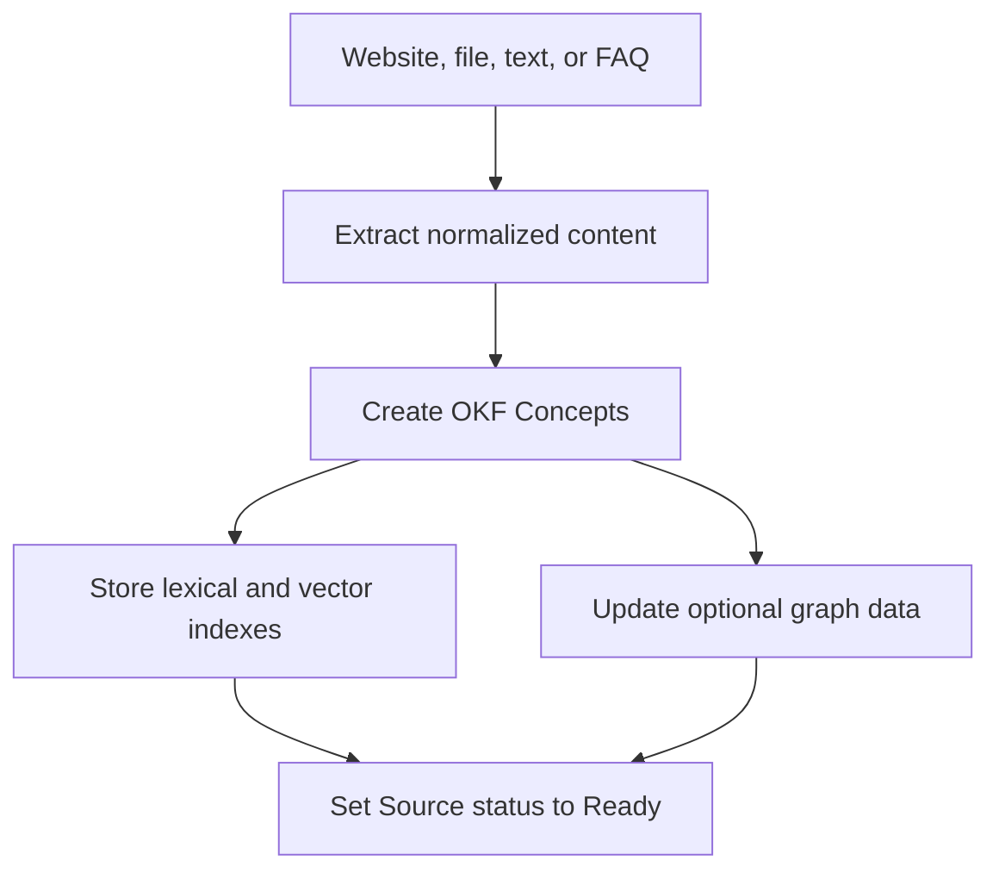

## Ingestión

Knowledge utiliza Conceptos de Open Knowledge Format (OKF). Un Concepto mantiene
una referencia a su Source original.

La ingesta de preguntas frecuentes crea un Concepto seleccionado con procedencia
de pregunta y respuesta. La ingesta de archivos y sitios web conserva el objeto
Source original cuando corresponde.

## Recuperación

El motor de ejecución puede recuperar Conceptos mediante búsqueda vectorial y
reserva léxica. El modo de grafo puede añadir navegación a través de relaciones
de Conceptos indexados.

Una pista de contexto puede limitar la recuperación a una colección relevante o
a un contexto similar a un curso cuando el tiempo de ejecución proporciona uno.

La búsqueda profunda aumenta el trabajo de navegación por el conocimiento dentro
de los límites del tiempo de ejecución. No realiza consultas en la web pública.

## Resolución de citas

La respuesta final cita Fuentes con nombre, no fragmentos de búsqueda opacos.
Los identificadores de citas se resuelven a través del Concepto hasta su Fuente
original.

El visitante puede abrir la pantalla de Fuentes después de la respuesta. La
Bandeja de entrada almacena las mismas partes de la cita junto con la
Conversación.

## Eliminación y nuevo rastreo

Al eliminar una fuente, los conceptos relacionados se retiran del grafo activo y
de los datos de búsqueda. El rastreo del sitio web reinicia la extracción y la
indexación de esa Fuente.
