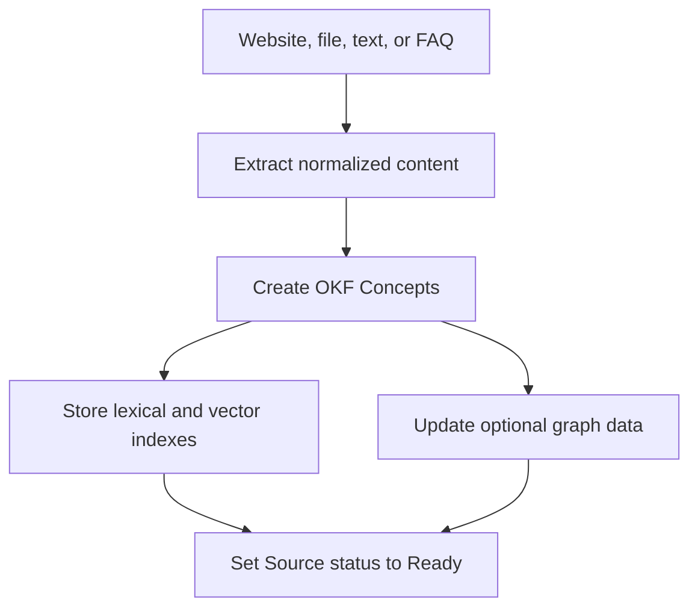

## Ingestion

Knowledge utilise des Concepts au format Open Knowledge Format (OKF). Un Concept
conserve une référence à sa Source d'origine.

L'ingestion de FAQ crée un Concept organisé avec la provenance des questions et
des réponses. L'ingestion de fichiers et de sites Web préserve l'objet Source
d'origine, le cas échéant.

## Récupération

Le moteur d'exécution peut récupérer des Concepts via la recherche vectorielle
et le repli lexical. Le mode graphe peut ajouter une navigation à travers les
relations indexées entre les Concepts.

Un indice contextuel peut limiter la récupération à une collection pertinente ou
à un contexte de type cours lorsque le moteur d'exécution en fournit un.

La recherche approfondie améliore la navigation dans les connaissances dans les
limites de l'environnement d'exécution. Il n'effectue pas de requêtes sur le Web
public.

## Résolution des citations

La réponse finale cite des Sources nommées, et non des extraits de recherche
opaques. Les identifiants de citation sont résolus via le Concept jusqu'à sa
Source d'origine.

Le visiteur peut ouvrir l'affichage des sources après la réponse. La boîte de
réception stocke les mêmes éléments de citation que la conversation.

## Suppression et nouvelle analyse

La suppression d'une Source retire les Concepts associés du graphe actif et des
données de recherche. La nouvelle analyse du site Web relance l'extraction et
l'indexation pour cette Source.
