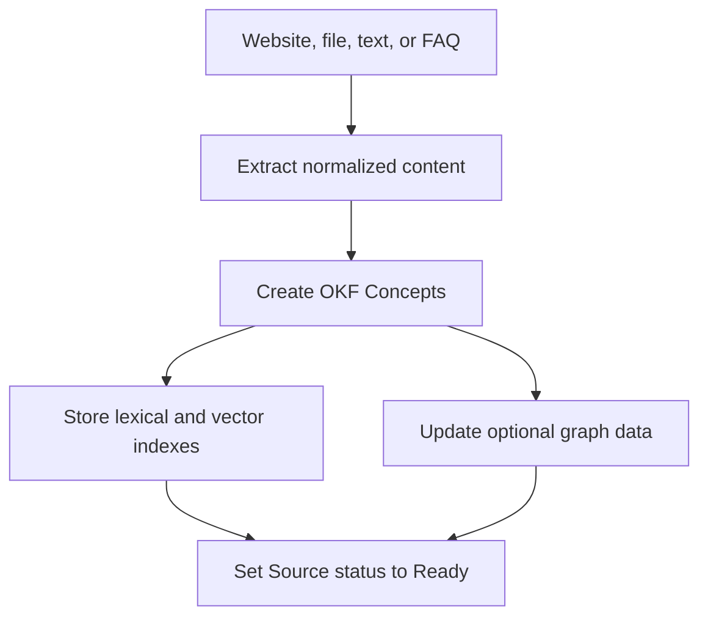

## Acquisizione

Knowledge utilizza i Concept in Open Knowledge Format (OKF). Un Concept mantiene
un riferimento alla sua Source originale.

L'importazione delle FAQ crea un Concept curato con provenienza di domanda e
risposta. L'importazione di file e siti web conserva l'oggetto Source originale,
ove applicabile.

## Recupero

Il runtime può recuperare i Concept tramite ricerca vettoriale e fallback
lessicale. La modalità Grafico può aggiungere la navigazione attraverso le
relazioni dei Concetti indicizzati.

Un suggerimento di contesto può limitare il recupero a una raccolta pertinente o
a un contesto simile a un corso, quando il runtime ne fornisce uno.

La Deep Search aumenta il lavoro di navigazione nella Knowledge all'interno dei
limiti del runtime. Non esegue query sul web pubblico.

## Risoluzione delle citazioni

La risposta finale cita fonti nominate, non frammenti di ricerca opachi. Gli
identificatori di citazione rimandano, attraverso il Concetto, alla sua Fonte
originale.

Dopo la risposta, il Visitatore può aprire la schermata delle Fonti. La Posta in
arrivo memorizza le stesse parti della citazione insieme alla Conversazione.

## Eliminazione e nuova scansione

L'eliminazione della fonte rimuove i Concept correlati dal grafo attivo e dai
dati di ricerca. La nuova scansione del sito web riavvia l'estrazione e
l'indicizzazione per quella Fonte.
