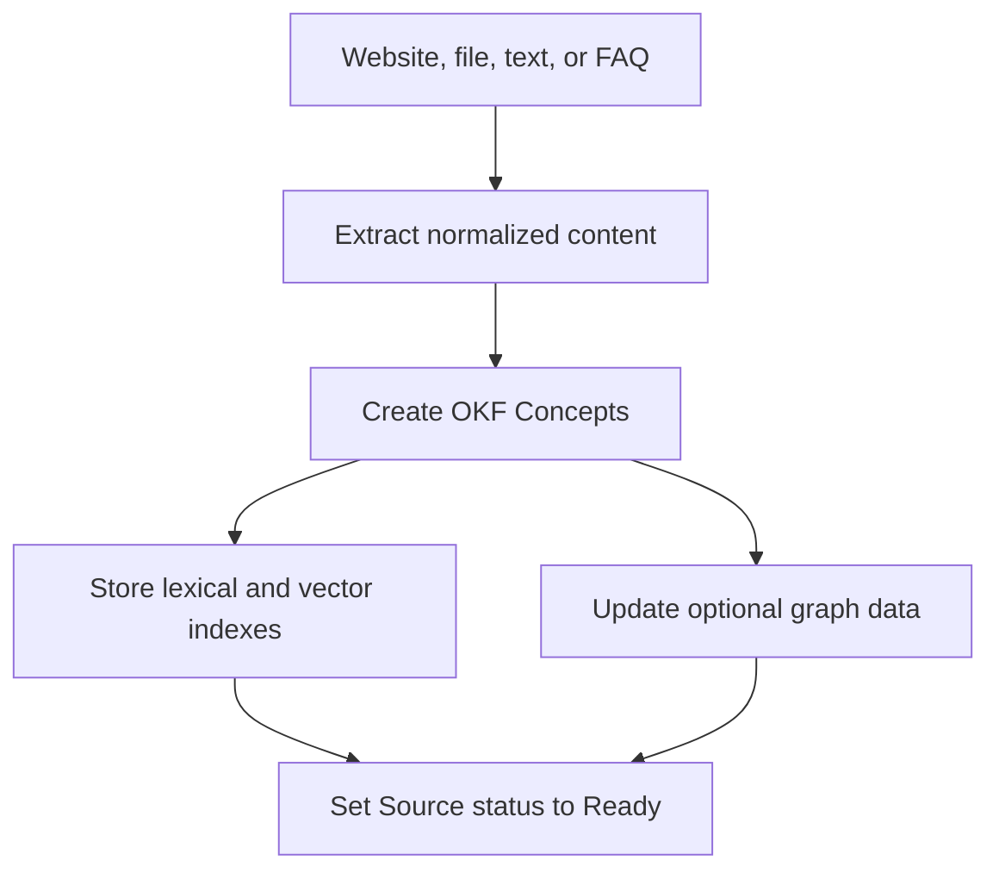

## Ingestion

Knowledge uses Open Knowledge Format (OKF) Concepts. A Concept keeps a reference to its original Source.

FAQ ingestion creates a curated Concept with question and answer provenance. File and website ingestion preserve the original Source object where applicable.

## Retrieval

The runtime can retrieve Concepts through vector search and lexical fallback. Graph mode can add navigation through indexed Concept relationships.

A Context Hint can constrain retrieval to a relevant Collection or course-like context when the runtime supplies one.

Deep Search increases Knowledge navigation work within runtime bounds. It does not query the public web.

## Citation resolution

The final answer cites named Sources, not opaque search chunks. Citation identifiers resolve through the Concept to its original Source.

The Visitor can open the Sources display after the answer. The Inbox stores the same citation parts with the Conversation.

## Deletion and recrawl

Source deletion retires related Concepts from active graph and search data. Website recrawl restarts extraction and indexing for that Source.
