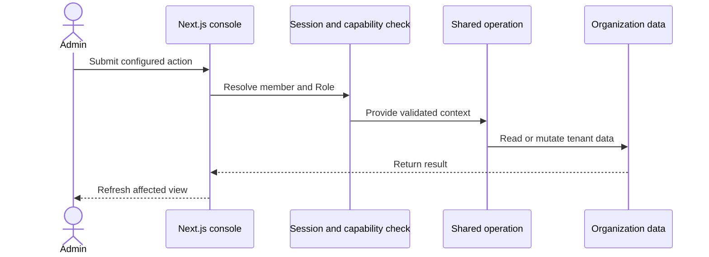

## Administratorvorgang

Serveraktionen lösen die Mitgliedersitzung auf, bevor sie eine freigegebene
Operation aufrufen. Die Sicherheit auf Datenbankzeilenebene bleibt Teil der
Konsolendatengrenze.

## API-Operation

API v1 hasht den Bearer-Schlüssel und löst seine Organisation und Rolle auf. Sie
validiert die Eingabe, bevor sie dieselbe Operation wie die Konsole aufruft.

Die API verwendet einen an die Organisation gebundenen Datenbank-Wrapper. Der
Wrapper ersetzt die Argumente der Organisation und prüft die Inhaberschaft für
den Zugriff auf Basis von Identifikatoren.

## CLI und MCP

Der CLI- und der MCP-Server verwenden `@ciele/client`. Der Client sendet
Bearer-authentifizierte Anfragen an API v1.

Der schreibgeschützte MCP-Schalter lehnt Mutationsaktionen ab, bevor der Client
eine Anfrage sendet. Serverseitige Rollenprüfungen gelten weiterhin für jede
akzeptierte Anforderung.

## Widget-Zug

Das Embed lädt die aktive Publication-Konfiguration. Die Chat-Route speichert
den Besucherzug und ruft die Laufzeitumgebung für den Gesprächszug auf.

Die Laufzeit wählt einen Flow aus, führt Aktionen aus, streamt
Antwort-Ereignisse und speichert Antwortteile. Das Widget rendert dieselben
strukturierten Teile.
