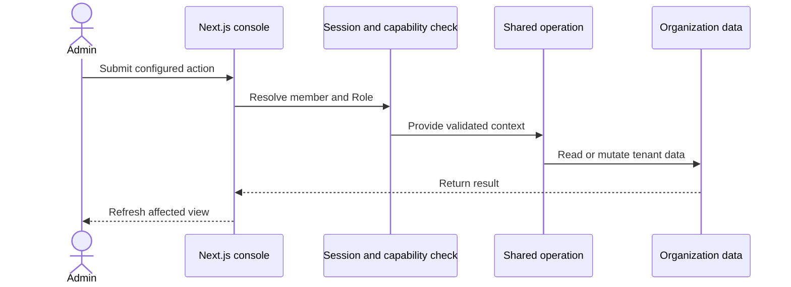

## Operación del administrador

Las acciones del servidor resuelven la sesión del miembro antes de llamar a una
operación compartida. La seguridad a nivel de fila de la base de datos sigue
formando parte del límite de datos de la consola.

## Operación de la API

La API v1 aplica un hash a la clave de portador y resuelve su Organización y
Rol. Valida la entrada antes de llamar a la misma operación que la consola.

La API utiliza un contenedor de base de datos anclado a la organización. El
contenedor reemplaza los argumentos de la organización y comprueba la propiedad
para el acceso basado en identificadores.

## CLI y MCP

La CLI y el servidor MCP usan `@ciele/client`. El cliente envía solicitudes
autenticadas por portador a la API v1.

El conmutador de solo lectura MCP rechaza las acciones de mutación antes de que
el cliente envíe una solicitud. Las comprobaciones de rol del lado del servidor
siguen aplicándose a todas las solicitudes aceptadas.

## Turno del widget

La incrustación carga la configuración activa de la publicación. La ruta de chat
conserva el turno del visitante y llama al tiempo de ejecución del turno de
conversación.

El tiempo de ejecución selecciona un flujo, ejecuta acciones, transmite eventos
de respuesta y almacena partes de respuesta. El widget representa las mismas
partes estructuradas.
