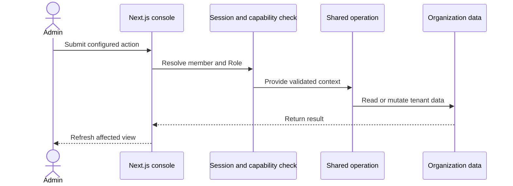

## Opération de l'administrateur

Les actions du serveur résolvent la session du membre avant d'appeler une
opération partagée. La sécurité au niveau des lignes de la base de données reste
incluse dans la limite des données de la console.

## Opération API

L'API v1 hache la clé du porteur et résout son organisation et son rôle. Elle
valide la saisie avant d'appeler la même opération que la console.

L'API utilise un wrapper de base de données épinglé à l'organisation. Le wrapper
remplace les arguments Organization et vérifie la propriété pour l'accès basé
sur un identifiant.

## CLI et MCP

La CLI et le serveur MCP utilisent `@ciele/client`. Le client envoie des
requêtes authentifiées au porteur à l'API v1.

Le commutateur MCP en lecture seule refuse les actions de mutation avant que le
client n'envoie une requête. Les vérifications de rôle côté serveur s'appliquent
toujours à chaque requête acceptée.

## Tour du widget

L'intégration charge la configuration active de la Publication. La route de chat
conserve le tour du visiteur et appelle le moteur d'exécution du tour de
conversation.

Le runtime sélectionne un flux, exécute des actions, diffuse des événements de
réponse et stocke les parties de réponse. Le widget affiche les mêmes parties
structurées.
