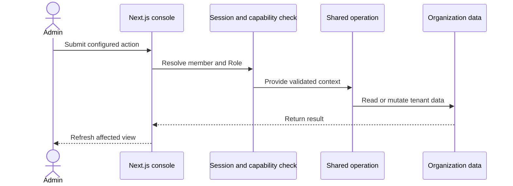

## Operazione dell'amministratore

Le azioni del server risolvono la sessione del membro prima di chiamare
un'operazione condivisa. La sicurezza a livello di riga del database rimane
parte del confine dei dati della console.

## Operazione API

L'API v1 esegue l'hashing della chiave del portatore e risolve la sua
Organizzazione e il suo Ruolo. Convalida l'input prima di chiamare la stessa
operazione della console.

L'API utilizza un wrapper di database associato all'organizzazione. Il wrapper
sostituisce gli argomenti dell'Organizzazione e verifica la proprietà per
l'accesso basato su identificatore.

## CLI e MCP

Il server CLI e MCP utilizza `@ciele/client`. Il client invia richieste
autenticate tramite bearer all'API v1.

Lo switch di sola lettura MCP rifiuta le azioni di modifica prima che il client
invii una richiesta. I controlli del ruolo lato server si applicano comunque a
ogni richiesta accettata.

## Turno del widget

L'embed carica la configurazione attiva della Pubblicazione. Il percorso della
chat conserva il turno del Visitatore e chiama il runtime del Turno di
Conversazione.

Il runtime seleziona un Flow, esegue le azioni, trasmette in streaming gli
eventi di risposta e memorizza le parti di risposta. Il widget visualizza le
stesse parti strutturate.
