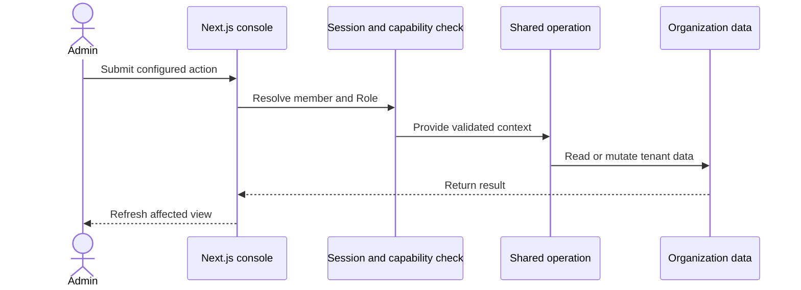

## Administrator operation

Server actions resolve the member session before they call a shared operation. Database row-level security remains part of the console data boundary.

## API operation

API v1 hashes the bearer key and resolves its Organization and Role. It validates input before it calls the same operation as the console.

The API uses an Organization-pinned database wrapper. The wrapper replaces Organization arguments and checks ownership for identifier-based access.

## CLI and MCP

The CLI and MCP server use `@ciele/client`. The client sends bearer-authenticated requests to API v1.

The MCP read-only switch refuses mutation actions before the client sends a request. Server-side Role checks still apply to every accepted request.

## Widget turn

The embed loads the active Publication configuration. The chat route persists the Visitor turn and calls the Conversation Turn runtime.

The runtime selects a Flow, runs actions, streams reply events, and stores reply parts. The widget renders the same structured parts.
