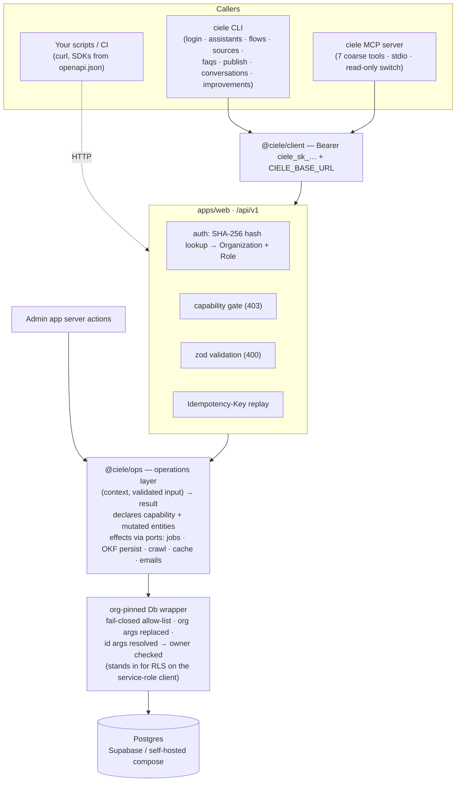
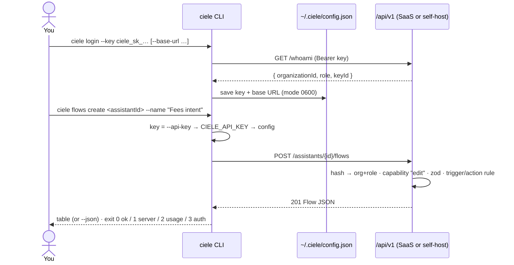
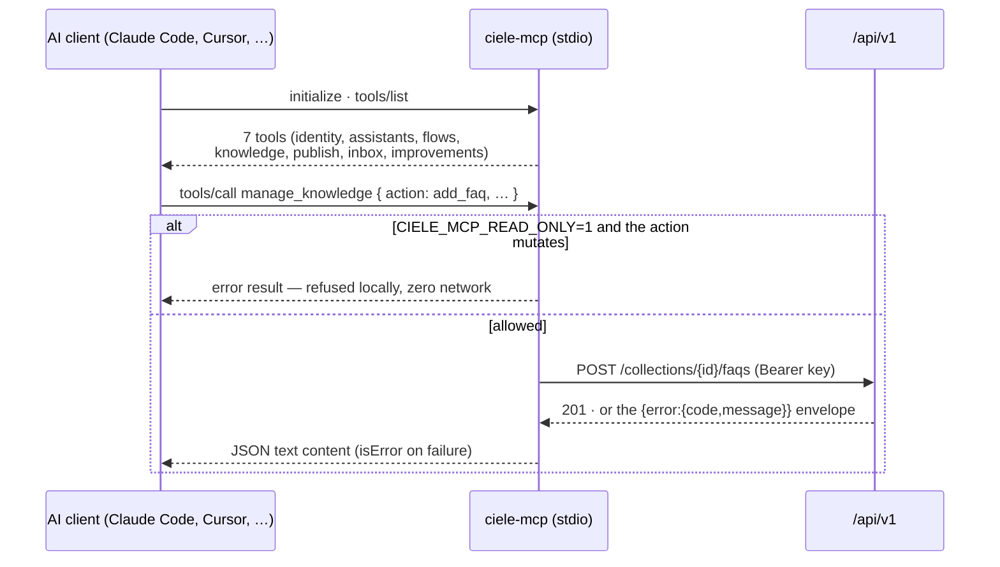
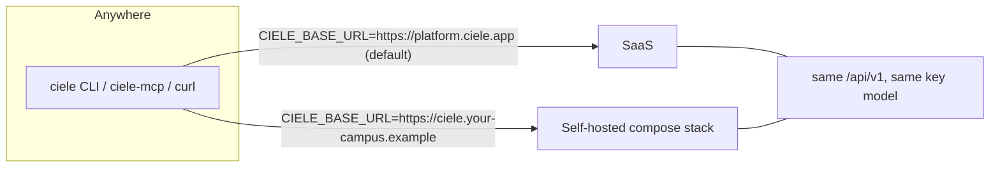

# CLI & MCP connection architecture

How the `ciele` CLI, the ciele MCP server, and any script reach a deployment —
SaaS (`platform.ciele.app`) or self-hosted — and what stands between an API key
and the database. Companion pages: [`v1-operations.md`](v1-operations.md) (the
operation catalogue) and [`connect-ai-clients.md`](connect-ai-clients.md)
(per-client setup). A reviewable diagram version of this page lives in
[`plans/ciele-cli-mcp-connections/`](../../plans/ciele-cli-mcp-connections/plan.mdx).

## The stack

One path for every programmatic caller. RBAC is the key's Role; tenancy is the
org-pinned wrapper; SaaS vs self-host is only a base URL.

Key properties, by construction:

- **The web app and the API cannot drift** — both surfaces execute the same
  operation objects from `@ciele/ops`; only context resolution differs
  (session + RLS-scoped Db vs API key + org-pinned Db).
- **A key can never out-rank its creator** — the Role is assigned at mint time,
  capped at the minting Member's Role, and every capability check reuses the
  same rank ladder as the admin app.
- **Cross-tenant access fails closed** — the org-pinned wrapper replaces
  organization arguments and resolves id-addressed rows to their owner before
  delegating; anything not allow-listed throws.

## CLI connection flow

`ciele login` validates before storing; later commands resolve credentials
flag → env → config file, so CI needs only the two env vars and a laptop never
needs them.

## MCP connection flow

The MCP server is a thin stdio adapter over the same client. Read-only mode is
enforced *inside the MCP process* — a refused mutation never produces network
traffic.

## Self-host = one variable

`GET /api/v1/meta` is the version-skew answer: it lists the `domains` a
deployment actually ships, so a newer client degrades gracefully against an
older self-hosted server. The full contract is served at
`GET /api/v1/openapi.json`.
