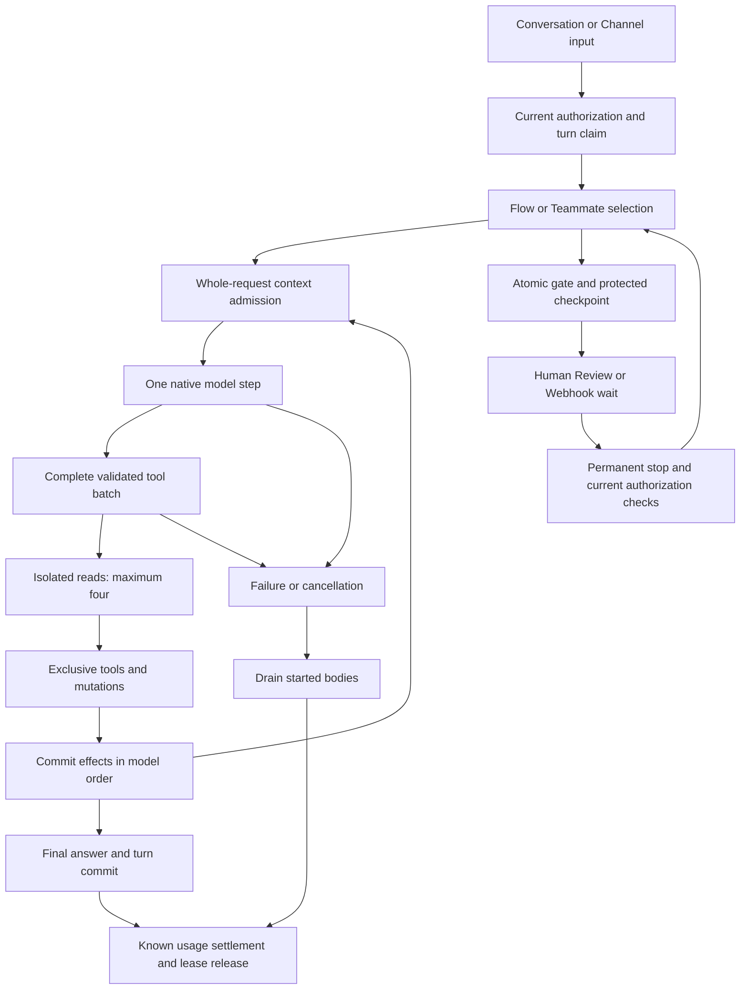

# Harness implementation

This change implements the agreed harness improvements across Conversation turns,
Channel turns, and Human Review and Webhook continuations. Ciele keeps its
Flow router, provider adapters, and Organization authorization.

## Reference study

The study uses [DeepSeek Harness](https://github.com/deepseek-ai/deepseek-harness/tree/639ed015397290b3745d163aafe02ffee4aa3f84)
at commit `639ed015397290b3745d163aafe02ffee4aa3f84`.
Its [architecture](https://github.com/deepseek-ai/deepseek-harness/blob/639ed015397290b3745d163aafe02ffee4aa3f84/docs/architecture.md)
separates request preparation, model steps, tool execution, and durable settlement.
Its [tool contract](https://github.com/deepseek-ai/deepseek-harness/blob/639ed015397290b3745d163aafe02ffee4aa3f84/packages/core/tools/README.md)
requires validated arguments, monotonic authorization, and cooperative cancellation.
Provider replay fixtures exercise real loop behavior with scripted responses.

Ciele adopts these boundaries through its existing internal modules.
The change adds no Cordis dependency, plugin loader, native runtime, or copied
DeepSeek implementation. The README includes the requested BibTeX attribution.

Three tool designs were considered: serial dispatch, read concurrency with
mutation barriers, and full ordered batches with isolated read effects.
The full batch design preserves every validated native call and lets independent
reads overlap without letting mutations race shared state.

## Agreed scope and implementation

| Decision | Implemented behavior | Main modules |
| --- | --- | --- |
| Q1: Frozen execution | Save admitted Assistant configuration, Flow actions, Skills, variables, and original text. Disable, delete, and unpublish permanently stop pending work. | `flow-continuation.ts`, `resume-gate-turn.ts`, database gate RPCs |
| Q2: Continuation identity | Save no attachments or verified identity proof. Keep extracted variables. Identity-dependent work requires a new attended turn. | Checkpoint factory, resume runtime, existing tool authorization |
| Q3: Context reduction | Remove complete older exchanges. Permit one capped, metered summary. Preserve required documents, evidence, and fences. | `context-budget.ts`, gather and write phases |
| Q4: Full tool batches | Admit complete native batches. Run at most four isolated reads together. Treat other tools as exclusive barriers. Commit in model order. | `tool-batch.ts`, `gather-phase.ts`, tool registration |
| Q5: Channel approvals | Participants and Owner/Admin readers see approvals. The requester or Owner/Admin decides. Execution checks current grants. | `approval-gate.ts`, `action-approvals.ts`, approval RLS |
| Q6: Model capacity | Check the whole request before each call. Offered models use verified capacities. Custom endpoints require declared windows. | `context-budget.ts`, `models.ts`, discovery and connection settings |
| Q7: Failure settlement | Settle known completed calls after later failures. Failure audits contain metadata only. | Conversation, Channel, Teammate, and handover runtimes |
| Q8: Lifecycle repair | Drain started bodies, release leases, and settle known usage. Crash-safe accounting remains deferred. | Turn finalization |
| Q9: Existing gates | Halt checkpointless gates clearly. Preserve decisions and callback payloads. Clean subscriptions before deletion. | Review and Webhook runtimes, bounded recovery RPC |

## Runtime boundaries

### Durable Flow continuations

Admission reads live stop generations before actions start. The atomic opener
locks the Assistant, Flow, and Conversation. It writes the gate and checkpoint
together, checking publication identity, generations, ownership, and deletion fences.

Disable/delete and publication deletion stamp permanent stops. Re-enable and
republish do not revive old work. Deletion closes admission before scanning
subscriptions. Monotonic triggers prevent direct member writes from reopening
that fence. Members cannot close it through direct database writes either.
Both database adapters implement this contract.

The checkpoint records the origin turn's completed or failed receipt. Resume jobs
wait while that origin runs. Database triggers enqueue settled gates after origin
completion. Bounded recovery restores missing jobs. Member clients cannot read
checkpoints or invoke their service-only RPCs.

Resume uses frozen actions and variables, with current provider connections and
typed credentials. Queued review delivery rechecks reviewer membership, mailbox
status, scopes, and owner membership. Slack delivery checks the current
Organization bot. Channel operations check current grants.

Free-form headers and query pairs can contain credentials under arbitrary names.
The checkpoint stores names and a gate-salted fingerprint, without raw values.
A changed admitted pair halts safely. Newly added pairs do not enter old work.
Typed credentials can rotate without changing frozen business arguments.

Legacy gates halt explicitly instead of resuming edited actions. Cleanup preserves
settled decisions and callback payloads. Webhook unsubscribe remains best effort:
its timestamp records an attempt, not confirmed external removal.

### Ordered tools and cancellation

The SDK validates native calls against schemas without executing bodies.
The dispatcher prepares the complete batch and rejects duplicate identifiers
before any body runs. It preserves signed native messages and emits native
results, including correction results for malformed calls.

Registered reads use isolated effect buffers. Their bodies overlap; their trace
and state effects commit in model order. Unspecified tools, knowledge/session
mutations, and external writes remain barriers. Cancellation prevents new body
admission and drains started bodies. Serialization failure becomes an honest
error result rather than abandoning running siblings.

An uncertain mutation blocks automatic repetition in the same turn. Its result
states that the operation may have completed. It does not claim rollback.
No timeout abandons a mutation body while the turn proceeds.

### Whole-request context admission

Resolved production models use a capacity guard. It counts serialized
instructions, native tools, history, input, evidence, framing, and reserved output.
UTF-8 bytes provide a conservative upper bound, with additional framing headroom.
The write phase budgets its actual projection, including quoted tool evidence.

A shared projection removes complete older exchanges first. It can summarize at
most 16,000 bytes of older conversational text once, reserving at most 1,024 output
tokens. That call uses the same guard and records usage. Memory Documents, authored
Skills, Sources, native tool pairs, and untrusted fences remain whole. Required
layers that do not fit fail before provider egress.

Offered capacities come from the provider catalog. Dynamic platform models require
verified capacity. Local subscription adapters reserve verified maximum output
and additional CLI framing. Unknown local models fail clearly. OpenAI-compatible
connections and self-hosted endpoints require an explicit window. Desktop setup,
environment examples, deployment config, and translated documentation expose it.

### Settlement and replay

Completed-call usage lives outside the success-only branch. Failed Conversation
and Channel turns settle it before releasing leases. Absorbed handover failures
transfer target usage once. Failed Channel markers remain stable and count toward
chain limits. New failure audits omit prompt, output, and raw error text. Existing
attended operator diagnostics remain available.

`harness-replay.test.ts` injects a scripted native provider at model resolution.
It drives production Conversation and Channel entrypoints through actual routing,
SDK validation, tools, persistence, approvals, and settlement. Cases cover
committed-request replay, malformed calls, later provider failure, mutation
preservation, Channel approvals, and failed handover usage. Database contracts,
role-switched SQL tests, leases, and provider wire tests remain separate evidence.

## Validation and rollout

Validation uses Node 22 and the frozen pnpm lockfile. Regular tests, type checks,
lint, security tests, boundaries, the public mirror gate, and repository script
checks run locally. Web, Desktop, CLI, and documentation production builds also
run. Web bundle and server-component payload budgets pass.

The unmodified aggregate `pnpm verify` command passes, including the default
Turbopack documentation build. Docker deployment jobs and authenticated live
provider smoke tests have not run.

The additive migration is
`supabase/migrations/20261002213212_harness_continuations_and_channel_approvals.sql`.
It has not been applied to production. Apply it through
`scripts/apply-migrations.sh` before enabling durable continuations and Channel
approvals. Older schemas cannot admit new gates. Legacy reads halt safely;
deletion refuses to proceed when its admission fence is unavailable. Existing
custom endpoints need their real server context window configured.

Detailed failed traces and a durable per-call accounting ledger remain deferred,
as agreed. Known-usage settlement does not guarantee crash-idempotent accounting.
A crash after provider execution can lose an unrecorded usage row. Recovery does
not automatically resolve abandoned origin turns or uncertain external mutations.
