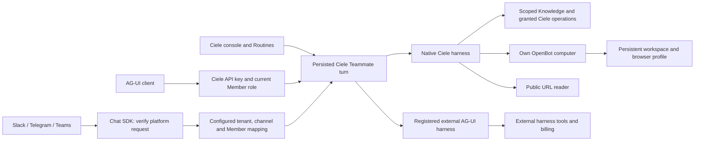

# Teammate execution and OpenDots research

Reviewed 2026-10-03: [OpenDots](https://github.com/CopilotKit/OpenDots/tree/c2569bb6a13a22e565cf3eb791c62267d06babb1),
and its pinned [OpenBot revision](https://github.com/CopilotKit/OpenBot/tree/b6932d31a8d6e7896c15139dfc27a6c6911deb27).
The two supplied diagrams describe protocol and channel boundaries. They are reference material.

## What OpenDots actually provides

OpenDots combines a TanStack AI agent loop, CopilotKit UI, AG-UI events, Intelligence-managed
threads, Channels SDK integration, and an OpenBot computer supervisor. Each bot has a separate
computer container, persistent workspace volume and browser profile. Tools navigate and operate
the browser, read/write files and run commands inside that computer. Parallel search is a
separate optional internet research service; the computer is not itself a search index.

This is a useful template for autonomous colleagues, but its single-owner deployment does not
provide Ciele's Organization tenancy, Member identity, Knowledge Scope, action approvals,
Provider Connections, usage ledger or scheduled Routines. Those remain owned by Ciele.

## Protocol choices

| Boundary | Choice | Reason |
| --- | --- | --- |
| Console and other agent clients ↔ harness | [AG-UI](https://docs.ag-ui.com/introduction) | Standard streamed runs, messages, tools and state; adapters exist for multiple frameworks. |
| Harness ↔ tools | Existing Ciele tools and MCP connections | AG-UI does not grant tool permissions or replace MCP. |
| Agent ↔ independent agent | Existing Ciele referrals | AG-UI is an agent/client interaction protocol. A2A is the distinct peer-agent protocol; no universal A2A claim is made here. |
| Messaging platform ↔ Ciele | [Vercel Chat SDK](https://chat-sdk.dev/) | Slack, Telegram and Teams adapters share one handler and persistent Redis transport state. Ciele retains identity and history. |
| Harness ↔ persistent computer | OpenBot HTTP API | Reuses browser, file and command execution without putting a shell in the web application. |

[CopilotKit Channels](https://docs.copilotkit.ai/slack) is a reasonable managed delivery option.
Its documented gateway, listener and Intelligence/thread model add another platform boundary.
Ciele already owns these facts. Chat SDK supplies adapters without making Intelligence mandatory.
This choice is about fit, not a claim that one SDK is the most popular or that all channels are
interchangeable. Only Slack, Telegram and Microsoft Teams are implemented in this change.

## Implemented flow

An Organization admin selects the harness and grants internet/browser/files/terminal access in
**Configure → Execution**. Defaults are the Ciele harness with all new capabilities off. Persona
editing cannot grant execution capabilities. The operation requires `manageMembers`; a database
trigger enforces the same rule for authenticated direct writes, alongside existing row-level
tenancy policies. The dedicated runtime API also carries this capability.

The native harness retains the existing turn journal, ordered tools, Ciele action approval gate,
memory, usage accounting and routines. Computers start lazily. Workspace and browser volumes
survive stop/start. The ID is derived from Organization and Teammate IDs. Child authentication is
derived per computer, and its master key, supervisor key, Ciele/provider keys and Docker socket
are never mounted into the computer. The supervisor alone owns the Docker socket.

Computer permissions authorize autonomous operations in that environment. They are not a
confirmation for each shell or browser action. The read ceiling removes shell, file writes,
click/type/key tools. Arbitrary shell requires files and internet permissions because it can do
both. Active operations recheck permissions every two seconds; cancellation or revocation stops
the owned computer. Ciele operation approval cards remain a separate boundary. Browser/terminal
effects on third-party websites are not mediated by Ciele's organization-operation gate.

Public URL reads use the existing protected reader. Browser navigation rejects non-public
targets before dispatch. Browser redirects and arbitrary shell egress are ultimately controlled
by the deployment network: use a dedicated host/network and egress policy. Containers share the
host kernel; this is not a VM security guarantee. OpenBot supports a hardened runtime such as
gVisor. All members allowed to use a Teammate share that Teammate's computer and files.

## Workspace viewer

Native computer tool receipts add an Agent Screen card inside the corresponding Teammate reply, including while the turn is streaming before answer text exists. The supplied card layout has a framed capture, hover/keyboard/touch Open control and an expanded dialog. The latest computer turn displays current browser captures and the current operation status. Earlier turns keep their receipts and explicitly open the current screen, not a historical recording. One authenticated observation loop supplies both this card and the Workspace sidebar, pauses when neither is visible, and clears captures on connection failures or revoked permissions. Collapsing the screen never cancels the task. The component does not simulate a cursor, task teaching, recording or desktop video.

The Teammate chat keeps a workspace launcher beside its inline activity cards.
The workspace viewer exposes Browser, Terminal and Files tabs in the same resizable shell-edge rail
as the Developer panel on desktop, and fullscreen on phones and touch tablets. Opening either
rail panel replaces the other. Desktop requests keep the viewer beside the audited chat; leaving
the Teammate page releases the rail. Screen capture is polling
(~2.5 seconds while visible), not a WebSocket video stream or a host desktop. The pinned computer's
`/screenshot` endpoint masks sensitive fields. Capture time and browser URL are shown; failures,
revoked permissions, stopped and unconfigured services clear the frame instead of retaining a stale
image. No decorative macOS capture, cursor or recording is presented as live work.

Authenticated `GET /api/teammates/{id}/computer?view=screen|files|file` resolves the same visible,
Organization-scoped Teammate as chat. These view operations use the owned child credential on the
server, check runtime grants before and after reading, validate container identity, bound responses,
and set `private, no-store`. They never ensure/start a stopped container or mutate browser snapshot
refs. File paths keep the existing traversal checks. Only admins/owners retain the existing
start/stop endpoint; observation cancellation does not stop the computer.

Browser URL and terminal command requests enter the existing Teammate conversation instead of a new
HTTP command-execution path. Terminal output is the bounded, redacted computer tool receipt from
that conversation. Closing the viewer does not stop an agent task. Demonstration recording and
human mouse/keyboard takeover are not implemented by this observer; the reference's illustrative
recording timer is not used.

## AG-UI behavior and limits

`POST /api/v1/teammates/{id}/ag-ui` accepts standard run input and returns AG-UI SSE. The latest
text user message starts the trusted Ciele turn. Caller-supplied history/state/forwarded props
cannot replace server history or permissions. Frontend tools, context and resume entries are
rejected. API keys are checked against their creator's current membership/role. Persisted threads
are scoped to Organization, Teammate, Member and transport; delivery/run IDs use the native turn
journal. Cancelling the SSE stream aborts the native turn.

Text, tool receipts and terminal run events use standard event types. Rich Ciele parts, notices
and flow labels use `ciele.*` custom events. Private reasoning is omitted. Approvals remain Ciele
cards and are decided in Ciele; no generic client tool-resume protocol is exposed.

For an external harness, only an operator-registered endpoint belonging to that Organization can
run. The request contains standing role, platform instructions, permitted standing memory, the
last 40 persisted text messages and per-thread external state. This is an explicit data-sharing
configuration. It sends no Ciele API/provider credentials or local tool catalogue. The external
harness owns its tools, approvals, billing and guardrails. A tool event is a transcript receipt,
never authority to call a Ciele tool. Native Knowledge Scope, model choices, computer grants and
Ciele action grants do not provision capabilities in that external harness.

Runs validate lifecycle identity and complete messages/tools, bound SSE frames/total bytes,
protect JSON patches against prototype modification, persist state only after a completed run,
and enforce a four-minute deadline plus a 90-second idle timeout. Private conversations save
external state in session state; group threads merge namespaces atomically per Teammate/harness.
External token costs are not fabricated in the Ciele ledger. Text and complete backend tool runs
are supported; attachments, external interrupts, frontend tool execution and resumptions are not.
An arbitrary harness needs an AG-UI adapter exposing this supported profile, not just a URL.

## Messaging behavior and limits

The SDK verifies Slack signatures, Telegram webhook secrets and Teams Bot Framework JWTs.
Ciele additionally pins the workspace/tenant, allow-lists channels and maps immutable platform
user IDs to Ciele Member IDs. It rechecks membership and Teammate visibility before execution and
before posting. A private Teammate answers only in a DM. There is no email inference or automatic
enrollment. Each Member has a separate persisted history even inside a shared remote thread;
outbound answers in a group are visible to that group's participants.

Redis stores SDK subscriptions, locks and delivery deduplication. Overlapping deliveries queue
up to ten messages; earlier queued messages retain their own sender and delivery ID. Entries
expire after ten minutes. The native journal prevents repeated execution of a completed turn,
but transport delivery is not an exactly-once outbox. A crash between answer commit and posting
can lose or duplicate a channel reply, and queued work needs a live webhook worker to drain.
Provider retries, hosting request limits and remote platform message limits still apply. These
endpoints are conversational webhooks; unattended work continues to use Ciele Routines. Installing
a bot or configuring a registry sends no message until an authorized platform event arrives.

See [deployment and smoke tests](runbooks/teammate-execution.md). Live infrastructure and bot
credentials must be configured separately; the migration is not applied to production by this change.
